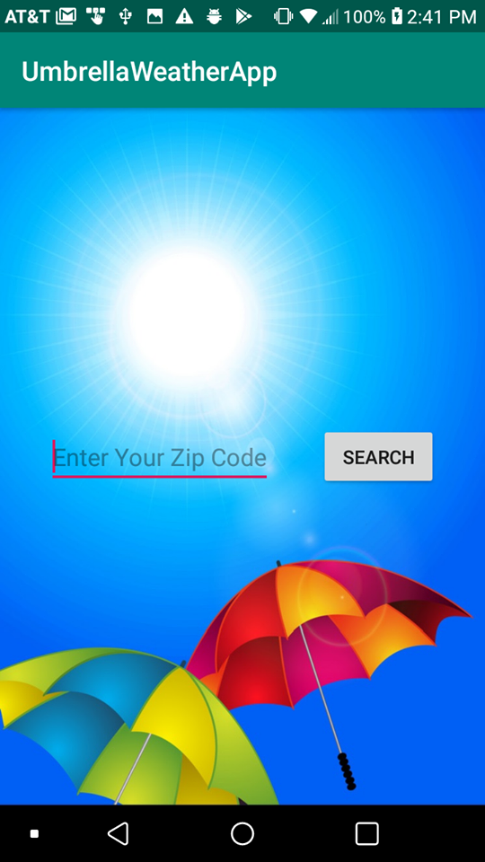
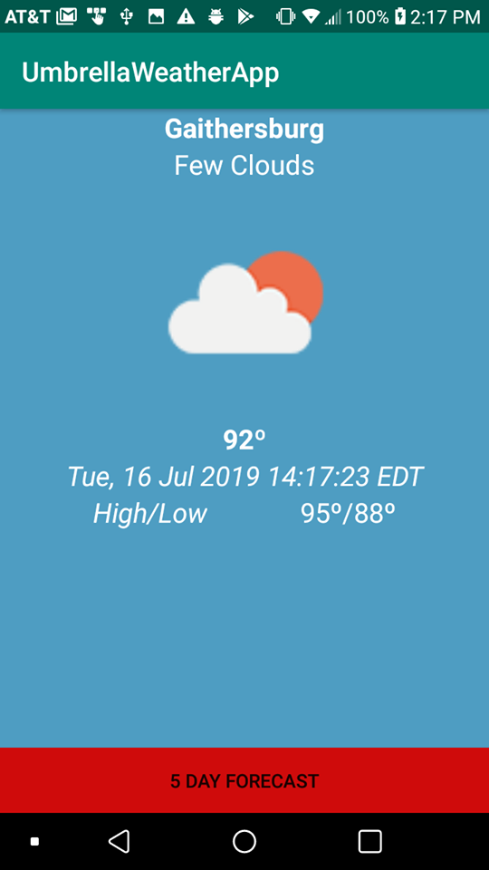
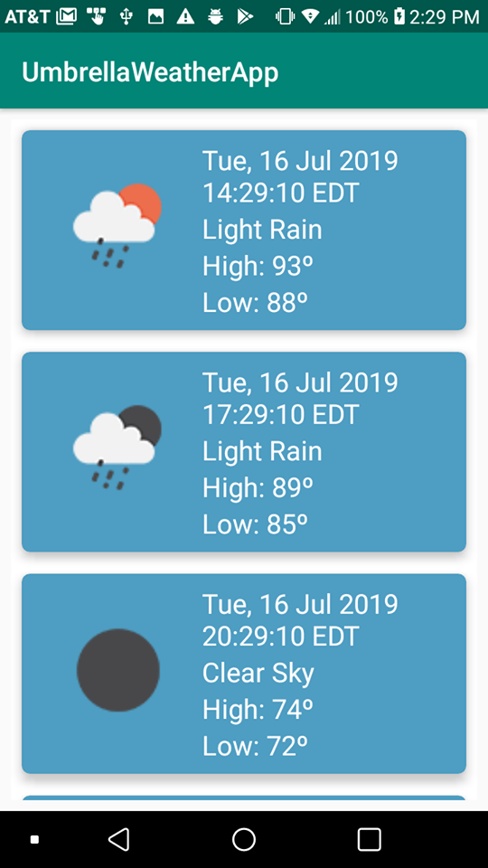
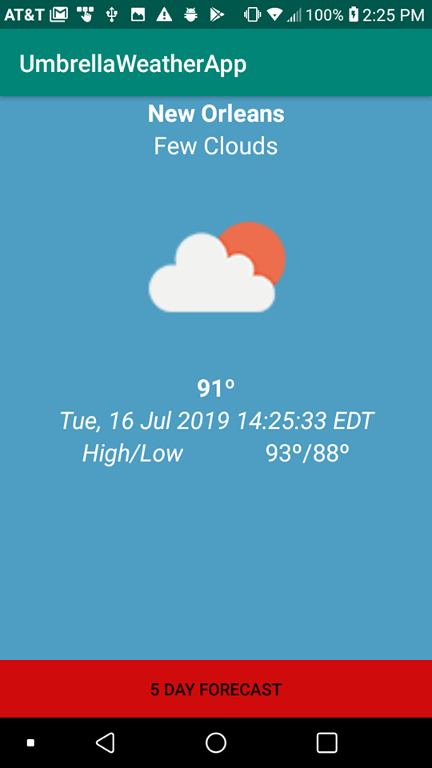
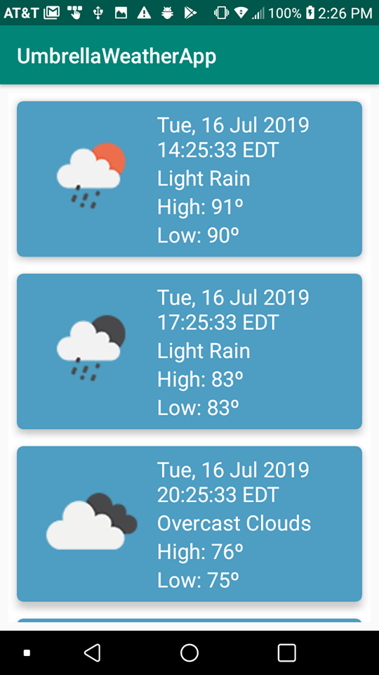
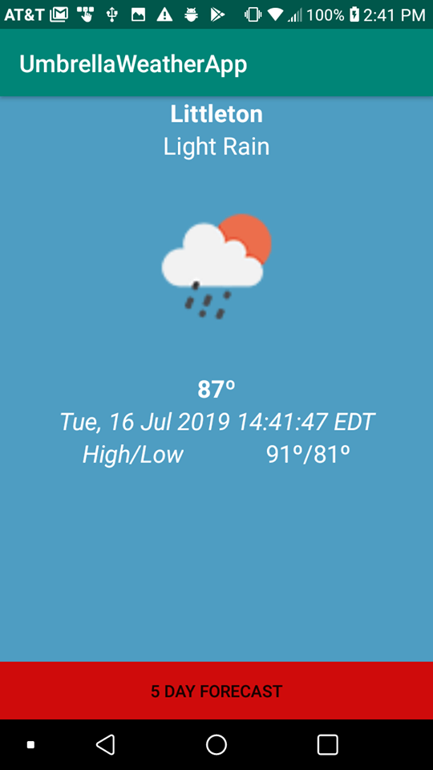
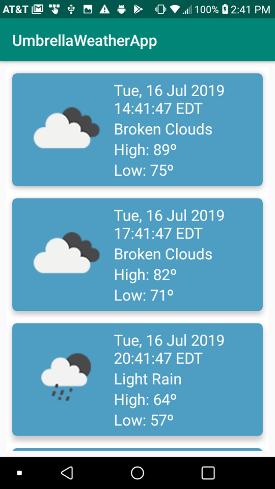
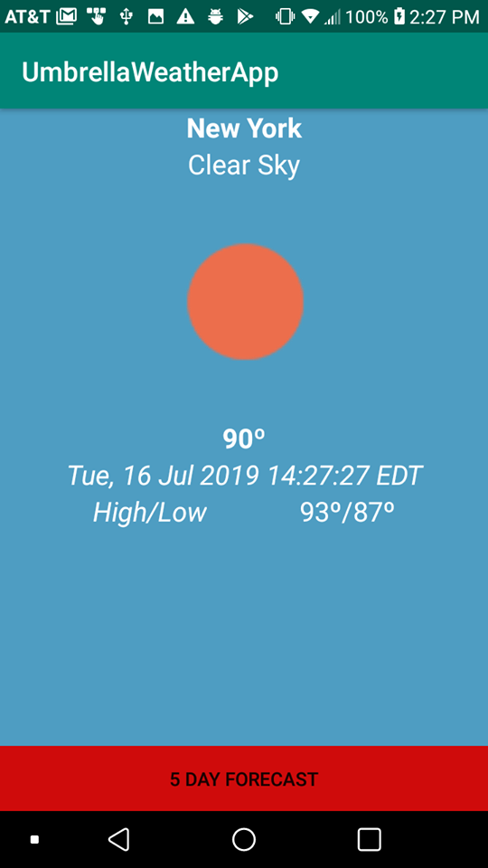
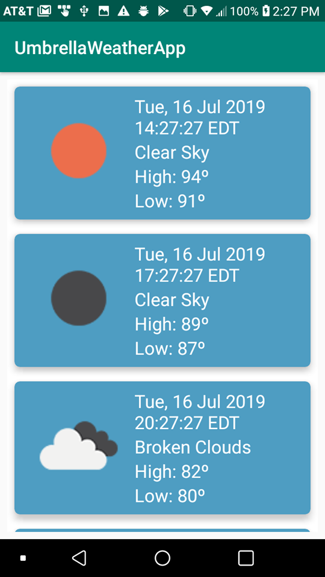

# UmbrellaWeatherAppWeek4
Weekend Umbrella Weather App

Weekend Homework 4
Complete the Walmart challenge.
Use https://openweathermap.org/api for the API source since weather underground is no longer free.

Instructions:

- Run the Android project
- Create a new Virtual Device if not already. Then, choose Pixel 2 XL, then click OK.
- User has to enter a zip code, then click Search.
- The entered city's current weather will be displayed.
- Click on 5 Day Forecast to show the next 5 days of forecast for every 3 hours.

